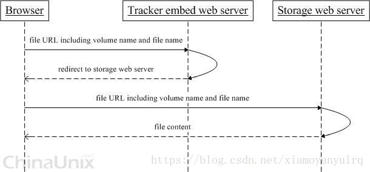

# FastDFS资料

## 1 FastDFS是什么

​	     FastDFS是一款开源高可用分布式文件系统。 他对文件进行管理，主要功能有：文件存储，文件同步，文件访问（文件上传/下载）,特别适合以文件为载体的在线服务，如图片网站，视频网站等

## 2 为什么使用FastDFS

### 	2.1 开源的分布式文件系统对比

​			指标对比

​		优缺点对比


​		架构方式

​	


优点总结：

1）系统无需支持POSIX(可移植操作系统)，降低了系统的复杂度，处理效率更高
2）支持在线扩容机制，增强系统的可扩展性
3）实现了软RAID，增强系统的并发处理能力及数据容错恢复能力
4）支持主从文件，支持自定义扩展名
5）主备Tracker服务，增强系统的可用性


缺点总结：
1）不支持POSIX通用接口访问，通用性较低
2）对跨公网的文件同步，存在较大延迟，需要应用做相应的容错策略
3）同步机制不支持文件正确性校验，降低了系统的可用性
4）通过API下载，存在单点的性能瓶颈

5）官方没有出监控的软件，就算git上的监控软件，也已经很过时了

### 2.1 FastDFS的几个问题

fastdfs的高可用，为啥高可用？

tracker的投票机制？

storage的备份机制？

fastdfs的安全问题？（防盗问题）

FastDFS如何解决文件同步延迟问题

## 3 FastDFS原理

### 3.1 角色构成

#### 		3.1.1 跟踪服务器(Tracker Server)：

​			跟踪服务器，主要做调度工作，起到均衡的作用；负责管理所有的storage server和group，每个storage在启动后会连接 Tracker，告知自己所属 group 等信息，并保持周期性心跳。多个Tracker之间是对等关系，不存在单点故障。

​			 Tracker根据storage心跳信息,建立group—>[storage server list]的映射表;tracker管理的元数据很少,会直接存放在内存;tracker 上的元信息都是由 storage 汇报的信息生成的,本身不需要持久化任何数据,tracker 之间是对等关系,因此扩展 tracker 服务非常容易,之间增加 tracker服务器即可,所有tracker都接受stroage心跳信息,生成元数据信息来提供读写服务(与 其他 Master-Slave 架构的优势是没有单点,tracker 也不会成为瓶颈,最终数据是和一个可用的 Storage Server进行传输的)

​			为了保证高可用，一个FastDFS集群当中可以有多个TrackerServer节点，由集群自动选举一个leader节点。

#### 		3.1.2 存储服务器(Storage Server):

​			存储服务器，主要提供容量和备份服务；以 group 为单位，每个 group 内可以有多台 storage server，组内的storage server上的数据互为备份。

​			存储容量空间以group内容量最小的storage为准;建 议group内的storage server配置相同;以group为单位组织存储能够方便的进行应用隔离、负载均衡和副本数定制;缺点是 group 的容量受单机存储容量的限制,同时 group 内机器坏掉,数据 恢复只能依赖 group 内其他机器重新同步(坏盘替换,重新挂载重启 fdfs_storaged 即可)

#### 		3.1.3 客户端(Client):

​			客户端，上传下载数据的服务器

#### 		3.1.4 角色中的关系


### 3.2 读写操作

#### 		3.2.1 上传数据

​				写操作的时候，storage会将他所挂载的所有数据存储目录的底下都创建2级子目录，每一级256个总共65536个，新写的文件会以hash的方式被路由到其中某个子目录下，然后将文件数据作为本地文件存储到该目录中。

​				

##### 		选择tracker server

当集群中不止一个tracker server时，由于tracker之间是完全对等的关系，客户端在upload文件时可以任意选择一个trakcer。


##### 		**选择存储的group**

当tracker接收到upload file的请求时，会为该文件分配一个可以存储该文件的group，支持如下选择group的规则： 1. Round robin，所有的group间轮询 2. Specified group，指定某一个确定的group 3. Load balance，剩余存储空间多多group优先


##### 		**选择storage server**

当选定group后，tracker会在group内选择一个storage server给客户端，支持如下选择storage的规则： 1. Round robin，在group内的所有storage间轮询 2. First server ordered by ip，按ip排序 3. First server ordered by priority，按优先级排序（优先级在storage上配置）


##### 		**选择storage path**

当分配好storage server后，客户端将向storage发送写文件请求，storage将会为文件分配一个数据存储目录，支持如下规则： 1. Round robin，多个存储目录间轮询 2. 剩余存储空间最多的优先
生成Fileid

选定存储目录之后，storage会为文件生一个Fileid，由storage server ip、文件创建时间、文件大小、文件crc32和一个随机数拼接而成，然后将这个二进制串进行base64编码，转换为可打印的字符串。


##### 		**选择两级目录**

当选定存储目录之后，storage会为文件分配一个fileid，每个存储目录下有两级256*256的子目录，storage会按文件fileid进行两次hash（猜测），路由到其中一个子目录，然后将文件以fileid为文件名存储到该子目录下。
生成文件名

当文件存储到某个子目录后，即认为该文件存储成功，接下来会为该文件生成一个文件名，文件名由group、存储目录、两级子目录、fileid、文件后缀名（由客户端指定，主要用于区分文件类型）拼接而成。

​	


##### 		**文件同步**

写文件时，客户端将文件写至group内一个storage server即认为写文件成功，storage server写完文件后，会由后台线程将文件同步至同group内其他的storage server。

每个storage写文件后，同时会写一份binlog，binlog里不包含文件数据，只包含文件名等元信息，这份binlog用于后台同步，storage会记录向group内其他storage同步的进度，以便重启后能接上次的进度继续同步；进度以时间戳的方式进行记录，所以最好能保证集群内所有server的时钟保持同步。

storage的同步进度会作为元数据的一部分汇报到tracker上，tracke在选择读storage的时候会以同步进度作为参考。

比如一个group内有A、B、C三个storage server，A向C同步到进度为T1 (T1以前写的文件都已经同步到B上了），B向C同步到时间戳为T2（T2 > T1)，tracker接收到这些同步进度信息时，就会进行整理，将最小的那个做为C的同步时间戳，本例中T1即为C的同步时间戳为T1（即所有T1以前写的数据都已经同步到C上了）；同理，根据上述规则，tracker会为A、B生成一个同步时间戳。


#### 3.2.2 下载文件

​					当客户端向Tracker发起下载请求时，并不会直接下载，而是先查询storage server（检测同步状态），返回storage server的ip和端口，然后客户端会带着文件信息（组名，路径，文件名），去访问相关的storage，然后下载文件。

​			


tracker发送download请求给某个tracker，必须带上文件名信息，tracke从文件名中解析出文件的group、大小、创建时间等信息，然后为该请求选择一个storage用来服务读请求。由于group内的文件同步时在后台异步进行的，所以有可能出现在读到时候，文件还没有同步到某些storage server上，为了尽量避免访问到这样的storage，tracker按照如下规则选择group内可读的storage。

1. 该文件上传到的源头storage - 源头storage只要存活着，肯定包含这个文件，源头的地址被编码在文件名中。 2. 文件创建时间戳==storage被同步到的时间戳 且(当前时间-文件创建时间戳) > 文件同步最大时间（如5分钟) - 文件创建后，认为经过最大同步时间后，肯定已经同步到其他storage了。 3. 文件创建时间戳 < storage被同步到的时间戳。 - 同步时间戳之前的文件确定已经同步了 4. (当前时间-文件创建时间戳) > 同步延迟阀值（如一天）。 - 经过同步延迟阈值时间，认为文件肯定已经同步了。
   小文件合并存储

   

### 3.3 HTTP访问支持

​			FastDFS的tracker和storage都内置了http协议的支持，客户端可以通过http协议来下载文件，tracker在接收到请求时，通过http的redirect机制将请求重定向至文件所在的storage上；除了内置的http协议外，FastDFS还提供了通过apache或nginx扩展模块下载文件的支持。

​			

## 4 搭建 FastDFS

### 4.1 部署图


### 4.2 环境准备工作

​		系统软件说明：

| 名称                 | 说明                                             |
| -------------------- | ------------------------------------------------ |
| CentOS               | 7.x（安装系统）                                  |
| libfastcommon        | FastDFS分离出的一些公用函数包                    |
| FastDFS              | FastDFS 5.11版本（稳定版）                       |
| fastdfs-nginx-module | FastDFS和nginx的关联模块，解决组内同步延迟问题   |
| nginx                | nginx 1.12.2（CentOS 7 下YUM可以安装的最新版本） |

​		整个搭建所需环境资源及用途如下表：

| 名称      | IP地址        | 应用                                             |
| --------- | ------------- | ------------------------------------------------ |
| tracker01 | 172.16.6.147  | FastDFS,libfastcommon                            |
| tracker02 | 172.16.95.223 | FastDFS,libfastcommon                            |
| storage01 | 172.16.6.147  | FastDFS,libfastcommon,nginx,fastdfs-nginx-module |
| storage02 | 172.16.95.223 | FastDFS,libfastcommon,nginx,fastdfs-nginx-module |
| nginx01   | 172.16.6.147  | nginx,keepalived                                 |
| nginx02   | 172.16.95.223 | nginx,keepalived                                 |
| VIP       | 192.168.0.200 | -                                                |


### 4.3 安装libfastcommon

```
$ mkdir /opt/libfastcommon
$ cd  /opt/libfastcommon
$ wget https://github.com/happyfish100/libfastcommon/archive/V1.0.43.tar.gz
$ mv V1.0.43.tar.gz libfastcommon-1.0.43.tar.gz
$ tar -zxvf libfastcommon-1.0.43.tar.gz
$ cd libfastcommon-1.0.43/
$ ./make.sh
$ ./make.sh install
```


### 4.4 安装FastDFS

```
$ mkdir /opt/fastdfs
$ cd  /opt/fastdfs
$ wget https://github.com/happyfish100/fastdfs/archive/V6.06.tar.gz
$ mv V6.06.tar.gz fastdfs-6.06.tar.gz
$ tar -zxvf fastdfs-6.06.tar.gz
$ cd fastdfs-6.06/
$ ./make.sh
$ ./make.sh install
#配置文件准备
$ cp /etc/fdfs/tracker.conf.sample /etc/fdfs/tracker.conf #tracker节点
$ cp /etc/fdfs/storage.conf.sample /etc/fdfs/storage.conf #storage节点
$ cp /etc/fdfs/client.conf.sample /etc/fdfs/client.conf #客户端文件，测试用
$ cp /opt/fastdfs/fastdfs-5.11/conf/http.conf /etc/fdfs/ #供nginx访问使用
$ cp /opt/fastdfs/fastdfs-5.11/conf/mime.types /etc/fdfs/ #供nginx访问使用
```


#### tracker server配置启动

```
$ vim /etc/fdfs/tracker.conf
#需要修改的内容如下
port=22122 # tracker服务器端口（默认22122,一般不修改）
base_path=/data/fastdfs # 存储日志和数据的根目录
#编辑启动文件
$ touch /usr/lib/systemd/system/fastdfs-tracker.service
[Unit]
Description=The FastDFS File server
After=network.target remote-fs.target nss-lookup.target

[Service]
Type=forking
ExecStart=/usr/bin/fdfs_trackerd /etc/fdfs/tracker.conf start
ExecStop=/usr/bin/fdfs_trackerd /etc/fdfs/tracker.conf stop
ExecRestart=/usr/bin/fdfs_trackerd /etc/fdfs/tracker.conf restart

[Install]
WantedBy=multi-user.target

$ systemctl daemon-reload
$ systemctl enable fastdfs-tracker.service
$ systemctl start fastdfs-tracker.service
$ netstat -tulnp #查看服务是否启动，端口是否打开
```


#### storage server配置启动

```
$ vim /etc/fdfs/storage.conf
#需要修改的内容如下
port=23000 # storage服务端口（默认23000,一般不修改）
base_path=/data/fastdfs # 数据和日志文件存储根目录
store_path0=/data/fastdfs # 第一个存储目录
tracker_server=192.168.0.1:22122 # tracker服务器IP和端口
tracker_server=192.168.0.2:22122 # tracker服务器IP和端口
group_name=group1
http.server_port=22000 # http访问文件的端口(默认8888,看情况修改,和nginx中保持一致)
#编辑启动文件
$ vim /usr/lib/systemd/system/fastdfs-storage.service

[Unit]
Description=The FastDFS File server
After=network.target remote-fs.target nss-lookup.target

[Service]
Type=forking
ExecStart=/usr/bin/fdfs_storaged /etc/fdfs/storage.conf start
ExecStop=/usr/bin/fdfs_storaged /etc/fdfs/storage.conf stop
ExecRestart=/usr/bin/fdfs_storaged /etc/fdfs/storage.conf restart

[Install]
WantedBy=multi-user.target

$ systemctl daemon-reload
$ systemctl enable fastdfs-storage.service
$ systemctl start fastdfs-storage.service
$ netstat -tulnp #查看服务是否启动，端口是否打开
#查看集群状态
$ fdfs_monitor /etc/fdfs/storage.conf list
[2018-11-06 00:00:00] DEBUG - base_path=/data/fastdfs/storage, connect_timeout=30, network_timeout=60, tracker_server_count=2, anti_steal_token=0, anti_steal_secret_key length=0, use_connection_pool=0, g_connection_pool_max_idle_time=3600s, use_storage_id=0, storage server id count: 0
server_count=2, server_index=0
tracker server is 192.168.0.1:22122
group count: 1
Group 1:
...
```


group1

两台机器配置可以完全一样，修改storage.conf如下配置项

　　　　　　base_path=/data/fastdfs

　　　　　　store_path0=/data/fastdfs

　　　　　　tracker_server=172.16.6.147:22122

　　　　　　tracker_server=172.16.95.223:22122

　　　　　　group_name=group1

启动group1的两台，并查看日志

　　　　　　[root@fastdfs data]#systemctl start fastdfs-storage.service

　　　　　　[root@fastdfs logs]#tailf /data/fastdfs/logs/storaged.log


group2

两台机器配置可以完全一样，修改storage.conf如下配置项

　　　　　　base_path=/data/fastdfs

　　　　　　store_path0=/data/fastdfs

　　　　　　tracker_server=172.16.6.147:22122

　　　　　　tracker_server=172.16.95.223:22122

　　　　　　group_name=group2

启动group2的两台，并查看日志

　　　　　　[root@fastdfs data]# systemctl start fastdfs-storage.service

　　　　　　[root@fastdfs logs]# tailf /data/fastdfs/logs/storaged.log


#### 启动成功


[root@test01 fdfs]# fdfs_monitor /etc/fdfs/storage.conf list
[2020-07-01 09:55:10] DEBUG - base_path=/data/fastdfs, connect_timeout=30, network_timeout=60, tracker_server_count=2, anti_steal_token=0, anti_steal_secret_key length=0, use_connection_pool=0, g_connection_pool_max_idle_time=3600s, use_storage_id=0, storage server id count: 0

server_count=2, server_index=1

tracker server is 172.16.95.223:22122

group count: 2

Group 1:
group name = group1
disk total space = 100662 MB
disk free space = 59020 MB
trunk free space = 0 MB
storage server count = 2
active server count = 1
storage server port = 23000
storage HTTP port = 80
store path count = 1
subdir count per path = 256
current write server index = 0
current trunk file id = 0

	Storage 1:
		id = 172.16.6.147
		ip_addr = 172.16.6.147 (test01)  WAIT_SYNC
		http domain = 
		version = 5.11
		join time = 2020-06-30 16:11:57
		up time = 2020-06-30 16:27:06
		total storage = 251854 MB
		free storage = 199596 MB
		upload priority = 10
		store_path_count = 1
		subdir_count_per_path = 256
		storage_port = 23000
		storage_http_port = 80
		current_write_path = 0
		source storage id = 172.16.95.223
		if_trunk_server = 0
		connection.alloc_count = 256
		connection.current_count = 0
		connection.max_count = 0
		total_upload_count = 0
		success_upload_count = 0
		total_append_count = 0
		success_append_count = 0
		total_modify_count = 0
		success_modify_count = 0
		total_truncate_count = 0
		success_truncate_count = 0
		total_set_meta_count = 0
		success_set_meta_count = 0
		total_delete_count = 0
		success_delete_count = 0
		total_download_count = 0
		success_download_count = 0
		total_get_meta_count = 0
		success_get_meta_count = 0
		total_create_link_count = 0
		success_create_link_count = 0
		total_delete_link_count = 0
		success_delete_link_count = 0
		total_upload_bytes = 0
		success_upload_bytes = 0
		total_append_bytes = 0
		success_append_bytes = 0
		total_modify_bytes = 0
		success_modify_bytes = 0
		stotal_download_bytes = 0
		success_download_bytes = 0
		total_sync_in_bytes = 0
		success_sync_in_bytes = 0
		total_sync_out_bytes = 0
		success_sync_out_bytes = 0
		total_file_open_count = 0
		success_file_open_count = 0
		total_file_read_count = 0
		success_file_read_count = 0
		total_file_write_count = 0
		success_file_write_count = 0
		last_heart_beat_time = 2020-07-01 09:55:01
		last_source_update = 1970-01-01 08:00:00
		last_sync_update = 1970-01-01 08:00:00
		last_synced_timestamp = 1970-01-01 08:00:00 
	Storage 2:
		id = 172.16.95.223
		ip_addr = 172.16.95.223  ACTIVE
		http domain = 
		version = 5.11
		join time = 2020-06-30 16:32:12
		up time = 2020-06-30 16:32:12
		total storage = 100662 MB
		free storage = 59020 MB
		upload priority = 10
		store_path_count = 1
		subdir_count_per_path = 256
		storage_port = 23000
		storage_http_port = 80
		current_write_path = 0
		source storage id = 
		if_trunk_server = 0
		connection.alloc_count = 256
		connection.current_count = 0
		connection.max_count = 0
		total_upload_count = 0
		success_upload_count = 0
		total_append_count = 0
		success_append_count = 0
		total_modify_count = 0
		success_modify_count = 0
		total_truncate_count = 0
		success_truncate_count = 0
		total_set_meta_count = 0
		success_set_meta_count = 0
		total_delete_count = 0
		success_delete_count = 0
		total_download_count = 0
		success_download_count = 0
		total_get_meta_count = 0
		success_get_meta_count = 0
		total_create_link_count = 0
		success_create_link_count = 0
		total_delete_link_count = 0
		success_delete_link_count = 0
		total_upload_bytes = 0
		success_upload_bytes = 0
		total_append_bytes = 0
		success_append_bytes = 0
		total_modify_bytes = 0
		success_modify_bytes = 0
		stotal_download_bytes = 0
		success_download_bytes = 0
		total_sync_in_bytes = 0
		success_sync_in_bytes = 0
		total_sync_out_bytes = 0
		success_sync_out_bytes = 0
		total_file_open_count = 0
		success_file_open_count = 0
		total_file_read_count = 0
		success_file_read_count = 0
		total_file_write_count = 0
		success_file_write_count = 0
		last_heart_beat_time = 2020-07-01 09:55:09
		last_source_update = 1970-01-01 08:00:00
		last_sync_update = 1970-01-01 08:00:00
		last_synced_timestamp = 1970-01-01 08:00:00 

Group 2:
group name = group2
disk total space = 100662 MB
disk free space = 59020 MB
trunk free space = 0 MB
storage server count = 2
active server count = 2
storage server port = 23001
storage HTTP port = 80
store path count = 1
subdir count per path = 256
current write server index = 0
current trunk file id = 0

	Storage 1:
		id = 172.16.6.147
		ip_addr = 172.16.6.147 (test01)  ACTIVE
		http domain = 
		version = 5.11
		join time = 2020-06-30 16:11:57
		up time = 2020-07-01 09:51:17
		total storage = 251854 MB
		free storage = 199596 MB
		upload priority = 10
		store_path_count = 1
		subdir_count_per_path = 256
		storage_port = 23001
		storage_http_port = 80
		current_write_path = 0
		source storage id = 
		if_trunk_server = 0
		connection.alloc_count = 256
		connection.current_count = 0
		connection.max_count = 0
		total_upload_count = 0
		success_upload_count = 0
		total_append_count = 0
		success_append_count = 0
		total_modify_count = 0
		success_modify_count = 0
		total_truncate_count = 0
		success_truncate_count = 0
		total_set_meta_count = 0
		success_set_meta_count = 0
		total_delete_count = 0
		success_delete_count = 0
		total_download_count = 0
		success_download_count = 0
		total_get_meta_count = 0
		success_get_meta_count = 0
		total_create_link_count = 0
		success_create_link_count = 0
		total_delete_link_count = 0
		success_delete_link_count = 0
		total_upload_bytes = 0
		success_upload_bytes = 0
		total_append_bytes = 0
		success_append_bytes = 0
		total_modify_bytes = 0
		success_modify_bytes = 0
		stotal_download_bytes = 0
		success_download_bytes = 0
		total_sync_in_bytes = 0
		success_sync_in_bytes = 0
		total_sync_out_bytes = 0
		success_sync_out_bytes = 0
		total_file_open_count = 0
		success_file_open_count = 0
		total_file_read_count = 0
		success_file_read_count = 0
		total_file_write_count = 0
		success_file_write_count = 0
		last_heart_beat_time = 2020-07-01 09:54:47
		last_source_update = 1970-01-01 08:00:00
		last_sync_update = 1970-01-01 08:00:00
		last_synced_timestamp = 1970-01-01 08:00:00 
	Storage 2:
		id = 172.16.95.223
		ip_addr = 172.16.95.223  ACTIVE
		http domain = 
		version = 5.11
		join time = 2020-06-30 16:32:12
		up time = 2020-07-01 09:52:29
		total storage = 100662 MB
		free storage = 59020 MB
		upload priority = 10
		store_path_count = 1
		subdir_count_per_path = 256
		storage_port = 23001
		storage_http_port = 80
		current_write_path = 0
		source storage id = 
		if_trunk_server = 0
		connection.alloc_count = 256
		connection.current_count = 0
		connection.max_count = 0
		total_upload_count = 0
		success_upload_count = 0
		total_append_count = 0
		success_append_count = 0
		total_modify_count = 0
		success_modify_count = 0
		total_truncate_count = 0
		success_truncate_count = 0
		total_set_meta_count = 0
		success_set_meta_count = 0
		total_delete_count = 0
		success_delete_count = 0
		total_download_count = 0
		success_download_count = 0
		total_get_meta_count = 0
		success_get_meta_count = 0
		total_create_link_count = 0
		success_create_link_count = 0
		total_delete_link_count = 0
		success_delete_link_count = 0
		total_upload_bytes = 0
		success_upload_bytes = 0
		total_append_bytes = 0
		success_append_bytes = 0
		total_modify_bytes = 0
		success_modify_bytes = 0
		stotal_download_bytes = 0
		success_download_bytes = 0
		total_sync_in_bytes = 0
		success_sync_in_bytes = 0
		total_sync_out_bytes = 0
		success_sync_out_bytes = 0
		total_file_open_count = 0
		success_file_open_count = 0
		total_file_read_count = 0
		success_file_read_count = 0
		total_file_write_count = 0
		success_file_write_count = 0
		last_heart_beat_time = 2020-07-01 09:54:59
		last_source_update = 1970-01-01 08:00:00
		last_sync_update = 1970-01-01 08:00:00
		last_synced_timestamp = 1970-01-01 08:00:00 
#### Client配置（用来测试）

```
$ vim /etc/fdfs/client.conf
#需要修改的内容如下
base_path=/data/fastdfs
tracker_server=192.168.0.1:22122 # tracker服务器IP和端口
tracker_server=192.168.0.2:22122 # tracker服务器IP和端口

#保存后测试,返回ID表示成功 如：group1/M00/00/00/rBAGk178QICANeyWAABNMImUU-4691.jpg
$ fdfs_upload_file /etc/fdfs/client.conf testfile
```


#### nginx配置fastdfs-nginx-module

```
$ mkdir /opt/fastdfs-nginx-module
$ cd /opt/fastdfs-nginx-module
$ wget https://github.com/happyfish100/fastdfs-nginx-module/archive/V1.22.tar.gz
$ mv V1.22.tar.gz fastdfs-nginx-module-1.22.tar.gz
$ tar -zxvf fastdfs-nginx-module-1.22.tar.gz
$ cp /opt/fastdfs-nginx-module/fastdfs-nginx-module-1.20/src/mod_fastdfs.conf /etc/fdfs

#需要修改的内容如下
$ vim /etc/fdfs/mod_fastdfs.conf
tracker_server=192.168.0.1:22122 # tracker服务器IP和端口
tracker_server=192.168.0.2:22122 # tracker服务器IP和端口
url_have_group_name=true
base_path=/data/fastdfs
store_path0=/data/fastdfs

安装好nginx
$ cd /opt/nginx/nginx-1.10.1
$ ./configure  --add-module=/opt/fastdfs-nginx-module/fastdfs-nginx-module-1.22/src
$ make
$ make install


#配置nginx.config(深坑，当有配置项中有fastdfs的配置错误时，会影响整个nginx运行！！！！！)
$ vim /opt/nginx/conf/nginx.conf
$ cp /opt/nginx/html/50x.html /data/html5/fastdfs
#增加如下内容
server {
        listen 22000; ## 该端口为storage.conf中的http.server_port相同
        server_name localhost;
        location ~/group[0-9]/ {
            root /data/fastdfs;
            ngx_fastdfs_module;
        }
        error_page 500 502 503 504 /50x.html;
        location = /50x.html {
            root /data/html5/fastdfs;
        }
    }
#如果nginx 当配置好了启动不起来，那先关闭nginx,再重启nginx(这个也是一个坑。。。。。。)
#测试下载，用外部浏览器访问刚才已传过的文件,引用返回的ID
http://121.196.50.38:22000/group1/M00/00/00/rBAGk178QICANeyWAABNMImUU-4691.jpg
#弹出下载则目前nginx已经OK
```


#### 配置nginx 常见出现的错误

在nginx的构建中会遇到不少的报错，具体如下：

- ./configure: error: the Google perftools module requires the Google perftools library. You can either do not enable the module or install the library.

​     解决方法如下：

```
$ yum install gperftools -y
```

- /configure: error: the HTTP rewrite module requires the PCRE library.
  解决方法如下：

```
$ yum -y install pcre pcre-devel
```

- ./configure: error: the HTTP cache module requires md5 functions from OpenSSL library. You can either disable the module by using --without-http-cache option, or install the OpenSSL library into the system, or build the OpenSSL library statically from the source with nginx by using --with-http_ssl_module --with-openssl= options.
  解决方法如下：

```
$ yum -y install openssl openssl-devel
```

- ./configure: error: the HTTP gzip module requires the zlib library. You can either disable the module by using –without-http_gzip_module option, or install the zlib library into the system, or build the zlib library statically from the source with nginx by using –with-zlib= option.
  解决方法如下：

```
$ yum install -y zlib-devel
```

- ./configure: error: the HTTP XSLT module requires the libxml2/libxslt libraries. You can either do not enable the module or install the libraries.
  解决方法如下：

```
$ yum -y install libxml2 libxml2-dev
$ yum -y install libxslt-devel
```

- ./configure: error: the HTTP image filter module requires the GD library. You can either do not enable the module or install the libraries.
  解决方法如下：

```
$ yum -y install gd-devel
```

- ./configure: error: perl module ExtUtils::Embed is required
  解决方法如下：

```
$ yum -y install perl-devel perl-ExtUtils-Embed
```

- ./configure: error: the GeoIP module requires the GeoIP library. You can either do not enable the module or install the library.
  解决方法如下：

```
$ yum -y install GeoIP GeoIP-devel GeoIP-data
```

- 在make过程中会出现一个报错：/usr/include/fastdfs/fdfs_define.h:15:27: fatal error: common_define.h: No such file or directory
  解决方法如下： 

```
修改fastdfs-nginx-module-1.20/src/config文件，修改如下： 
ngx_module_incs="/usr/include/fastdfs /usr/include/fastcommon/" 
CORE_INCS="$CORE_INCS /usr/include/fastdfs /usr/include/fastcommon/" 
然后重新./configure && make，就可以了
```


## 5 FastDFS机制分析

### 5.1 FastDFS tracker leader机制介绍

 		tracker server对节点数没有要求，并且考虑到业界流行的leader选举算法Raft算法比较复杂，因此采用了基于规则的简单算法，尽可能选出最靠谱的leader，我们可以将其理解为论资排辈算法。tracker leader的选举包含预选和确认两个动作，其中”确认“是由预选出来的leader将其身份通知给各个tracker server。下面介绍一下预选规则和步骤：

1. 如果一台tracker server已经是leader了，那么保留它的资格，否则到下一步；

2. 选择运行时间最长的tracker server，如果均相同到下一步；

3. 选择重启时间间隔最短的tracker server，如果均相同到下一步；

4. 选择IP地址最大的tracker server，如果均相同到下一步；

5. 选择端口最大的tracker server。

注：运行时间和重启时间间隔，按300秒取整加以钝化，以消除批量重启多个fdfs_trackerd实例的微小时间差异，使得钝化后的时间一致。


  tracker leader选举出来后，follower定期（目前是每秒）通过ping检测leader是否存活。如果连续三次ping leader失败，则重新选举leader。


  简单起见，以两台tracker server为例说明分布式系统著名的脑裂现象。如果两台tracker server之间因某种原因（比如路由器或交换机故障）导致不能相互通信，这时候就会发生两台tracker server均认为自己是leader的情况，产生脑裂。如果两台tracker server之间的网络通道不能恢复畅通，那么脑裂现象将会一直持续。 

  FastDFS对可能存在的tracker leader脑裂问题又是如何解决的呢？解决方法其实很简单，引入storage server作为观察者和协调者即可。storage server向所有tracker server定期报告其状态（包括磁盘可用空间、文件操作统计信息等等），tracker leader在返回的response中会告诉storage server其身份，然后storage server就知道tracker leader是否出现多个的异常了。如果出现了多个leader，storage server将通知这些tracker server重新选举leader。


### 5.2 FastDFS防盗链

#### 5.2.1 开启防盗链检查

vim /etc/fdfs/http.conf

```HTML

# HTTP default content type
http.default_content_type = application/octet-stream
 
# MIME types mapping filename
# MIME types file format: MIME_type  extensions
# such as:  image/jpeg  jpeg jpg jpe
# you can use apache's MIME file: mime.types
http.mime_types_filename=mime.types
 
# if use token to anti-steal
# default value is false (0)
http.anti_steal.check_token=true       # 修改1，开启防盗链检查
 
# token TTL (time to live), seconds
# default value is 600
http.anti_steal.token_ttl=900  # 选择性修改token的过期时间(测试上暂时设置为60s)
 
# secret key to generate anti-steal token
# this parameter must be set when http.anti_steal.check_token set to true·
# the length of the secret key should not exceed 128 bytes
http.anti_steal.secret_key=123456    # 修改2，防盗链密码
 
# return the content of the file when check token fail
# default value is empty (no file sepecified)
# 修改3，配置拒绝访问后显示的图片，需要是个有效可访问的图片
http.anti_steal.token_check_fail=/opt/fastdfs/fastdfs-6.06/conf/anti-steal.jpg   
 
# if support multi regions for HTTP Range
# default value is true
http.multi_range.enabed = true
```


重启nginx

nginx -s reload


#### 5.2.2 开发服务端代码修改

http.anti_steal_token = true  *# 启动防盗链*

http.secret_key = 123456   *# 防盗链密码*

采用  fastdfs-example 中的 /file/getfileToken获取文件路径


## 6 FastDFS源码分析

### 6.1 协议

FastDFS服务端与客户端通讯时候采用的是自定义的通讯协议，如下图所示


协议包由两部分组成：header和body

- header共10字节，格式如下：
  - 8 bytes body length
  - 1 byte command
  - 1 byte status
- body数据包格式由取决于具体的命令，body可以为空


### 6.2 命令代码和通讯状态代码

Tracker管理命令代码

| 名称                        | 命令 |
| --------------------------- | ---- |
| 删除storage                 | 93   |
| 获取下载节点QUERY_FETCH_ONE | 102  |
| 获取更新节点QUERY_UPDATE    | 103  |
| 不按组获取存储节点          | 101  |
| 按组获取存储节点            | 104  |
| 获取组列表                  | 91   |
| 获取存储节点列表            | 92   |


 Store文件上传命令代码

| 名称                   | 命令 | 说明                                                         |
| ---------------------- | ---- | ------------------------------------------------------------ |
| 文件上传               | 11   | 一般的文件上传，上传后为主文件                               |
| 上传附属文件           | 21   | "上传从文件文件，比如主文件为xxx.jpg,从文件(缩略图)为xxx-150_150.jpg" |
| 删除文件               | 12   | 删除文件                                                     |
| 设置文件元数据         | 13   | 上传文件创建日期，标签等                                     |
| 文件下载               | 14   |                                                              |
| 获取文件元数据         | 15   |                                                              |
| 查询文件信息           | 22   | 查询文件信息                                                 |
| 创建支持断点续传的文件 | 23   | 创建一个支持断点续传的文件                                   |
| 断点续传               | 24   | 上传可断点上传的文件，如将大文件切为几份，分开上传           |
| 文件修改               | 34   | 修改支持断点上传的文件                                       |
| 清除文件               | 36   | 截取(清除)支持断点上传的文件                                 |


报文通讯状态代码

| 名称               | 代码 |
| ------------------ | ---- |
| 客户端关闭连接命令 | 82   |
| 连接状态检查命令   | 111  |
| 服务端正确返回报文 | 100  |


### 6.3 java客户端 底层连接原理

```
参数  connection_pool.enabled = true   是否使用连接池（socket）
```


如果使用连接池：

org.csource.fastdfs.pool.ConnectionPool 中：

```
private final static ConcurrentHashMap<String, ConnectionManager> CP = new ConcurrentHashMap<String, ConnectionManager>();

/**
* 会每次初始化 的 storageClinet,trackerClient 的链接放入 ConcurrentHashMap 中
*/
public static Connection getConnection(InetSocketAddress socketAddress) throws MyException {
    if (socketAddress == null) {
        return null;
    }
    String key = getKey(socketAddress);
    ConnectionManager connectionManager;
    connectionManager = CP.get(key);
    if (connectionManager == null) {
        synchronized (ConnectionPool.class) {
            connectionManager = CP.get(key);
            if (connectionManager == null) {
                connectionManager = new ConnectionManager(socketAddress);
                CP.put(key, connectionManager);
            }
        }
    }
    return connectionManager.getConnection();
}
```


org.csource.fastdfs.pool.Connection 链接的类：

```
//底层还是用java socket编写
private Socket sock;
private InetSocketAddress inetSockAddr;
private Long lastAccessTime = System.currentTimeMillis();

private boolean needActiveTest = false;

public Connection(Socket sock, InetSocketAddress inetSockAddr) {
    this.sock = sock;
    this.inetSockAddr = inetSockAddr;
}
```


### 6.4 fastdfs服务端

## 7 FastDFS的社区

官方论坛 http://bbs.chinaunix.net/forum-240-1.html
FastDfs google Code http://code.google.com/p/fastdfs/
分布式文件系统FastDFS架构剖析 http://www.programmer.com.cn/4380/